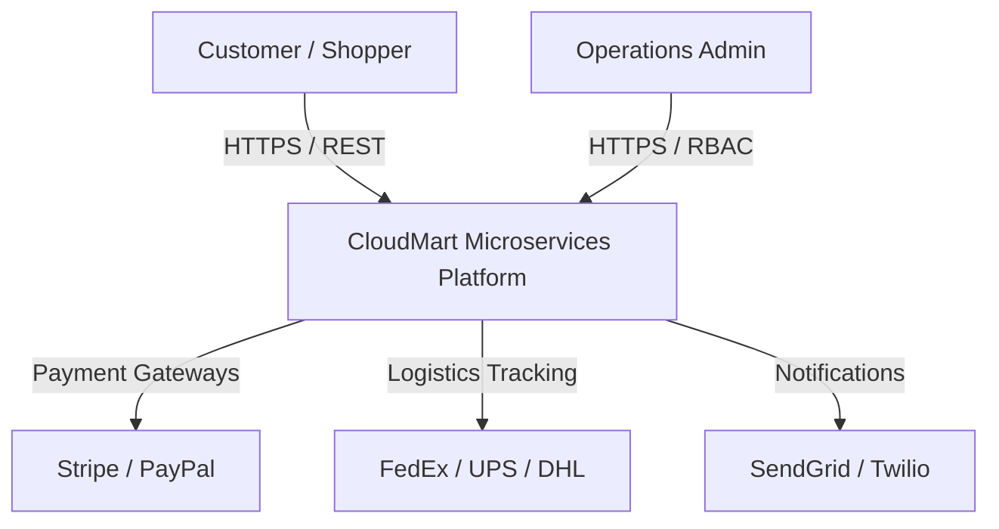
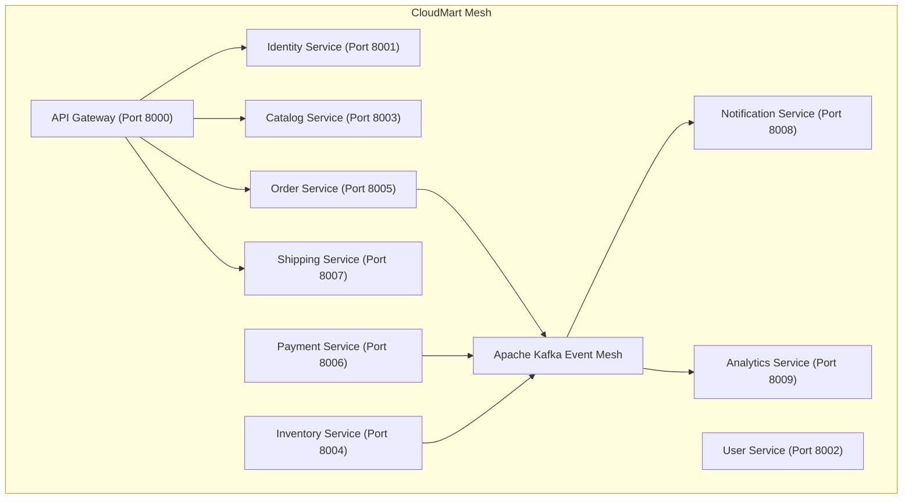

# C4 Architecture Model - CloudMart Platform

## Level 1: Context Diagram

```mermaid
graph TD
    User["Customer / Shopper"] -->|HTTPS / REST| CloudMart["CloudMart Microservices Platform"]
    Admin["Operations Admin"] -->|HTTPS / RBAC| CloudMart
    CloudMart -->|Payment Gateways| Stripe["Stripe / PayPal"]
    CloudMart -->|Logistics Tracking| FedEx["FedEx / UPS / DHL"]
    CloudMart -->|Notifications| SendGrid["SendGrid / Twilio"]
```

## Level 2: Container Diagram

```mermaid
graph TD
    subgraph CloudMart Mesh
        Gateway["API Gateway (Port 8000)"]
        Auth["Identity Service (Port 8001)"]
        User["User Service (Port 8002)"]
        Catalog["Catalog Service (Port 8003)"]
        Inventory["Inventory Service (Port 8004)"]
        Order["Order Service (Port 8005)"]
        Payment["Payment Service (Port 8006)"]
        Shipping["Shipping Service (Port 8007)"]
        Notification["Notification Service (Port 8008)"]
        Analytics["Analytics Service (Port 8009)"]
        Kafka["Apache Kafka Event Mesh"]
    end

    Gateway --> Auth
    Gateway --> Catalog
    Gateway --> Order
    Gateway --> Shipping
    Order --> Kafka
    Payment --> Kafka
    Inventory --> Kafka
    Kafka --> Notification
    Kafka --> Analytics
```
